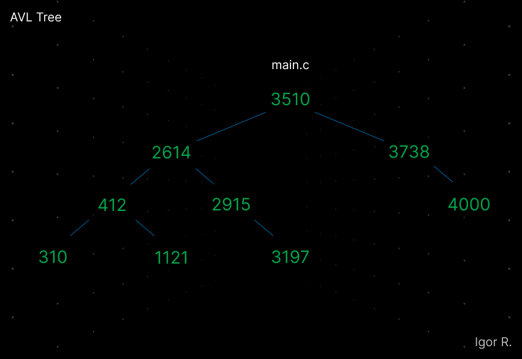

## AVL Tree Implementation in C

  

### Introduction
This C code implements an AVL tree. AVL trees ensure that the depths of the left and right subtrees of any node differ by at most one, maintaining a balanced structure and efficient search, insertion, and deletion operations.

The time complexity of these operations is logarithmic - O(log n) -, on average.

### Applications
AVL Trees are widely used in various domains due to their efficient performance and versatility. Some common applications include data structures, algorithms and database systems.

### Functions
- `init()`: Initializes a new empty tree.
- `rotateClockwise()` and `rotateCounterclockwise()`: Both functions perform rotations on the given node to rebalance the tree.
- `balance()`: Checks the balance factor of a node and performs appropriate rotations to balance the tree.
- `updateDepths()`: Recalculates the depths of all nodes in the subtree.
- `insertNode()`: Inserts a new node into the tree.
- `removeNode()`: Removes a node from the tree.
- `search()`: Searches for a node with a given value in the tree.
- `traverse()`: Performs traversal of the tree in ascending order, printing the values of the nodes.

### Additional Information
The source code was written from scratch, with the assistance of FIAP's "High Performance Codes - Nano Course".
